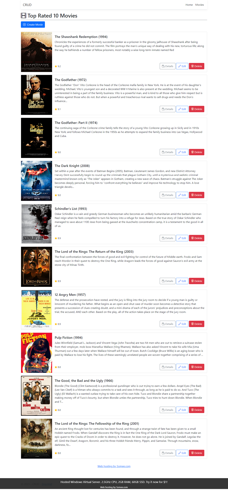

# ASP.NET CORE MVC 

This is an implementation on the ASP.NET CORE MVC  approach

## Table of contents

- [Overview](#overview)
  - [Screenshot](#screenshot)
  - [Links](#links)
- [My process](#my-process)
  - [Built with](#built-with)

## Overview
the project is viewing implementation of CRUD operations on ASPNET core mvc

### Screenshot

### Links

- Solution URL: [solution](https://github.com/engatef2012/ASP.net-Core-MVC-Example)
- Live Site URL: [Temporary Demo](http://www.aspmvc.somee.com/)

## My process

### Built with
- ntoastnotify 8.0.0 package
- Bootstrap 5
- animate.css library
- bootbox.js library
- bootstrap-datepicker library
- bootstrap-icons library
- Mobile-first workflow
